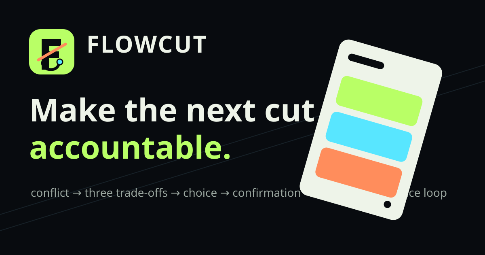

<p align="center">
  
</p>

# FlowCut

交片前只剩两个小时。素材里好镜头很多。客户又说：“开头再抓人一点。”真正难的不是多剪一版，而是决定第一刀落在哪里。还要知道删掉什么以后，这条片子的意思仍然在。

FlowCut 不替你按下确认键。它把素材观察、观众、平台和期限摊在一起，让三条剪法的得失都看得见。你选定之后，会得到一份能继续改、也能带去复盘的时间线。

[完整编辑器（Vercel）](https://flowcut-ai-studio.vercel.app/projects) · [静态兼容体验（GitHub Pages）](https://joyceleo326.github.io/flowcut-ai-studio/) · [中文完整使用指南](docs/USAGE.zh-CN.md)

## 把这一刀想清楚

1. **先说清交付处境。** 填写你的角色、观众、平台、目标时长、期限，以及这次最不能丢掉的东西。
2. **需要时放入真实素材。** 最多选择八个视频、音频或图片。浏览器会生成预览并读取文件信息，但不会把素材上传出去。
3. **写下你真正看见的内容。** 按镜头顺序描述动作、变化和结果。FlowCut 只使用这些观察，不会假装理解了没有分析过的画面。
4. **并排看三条剪法。** 开场、结构、收益、代价、素材依据和时间比例都不同。先看主动放弃了什么，再看哪条分数高。
5. **接受取舍，再确认。** 点选卡片还不算批准。只有你明确接受这条路线的代价并确认，它才成为 V1。
6. **检查连续时间线。** 导出前逐段看时间范围、保留依据、字幕、画幅和交付检查项。
7. **下载能带走的文件。** Markdown 剪辑单和 JSON 时间线都会保存任务、选择、取舍、片段和确认版本。
8. **把复盘带回下一版。** 写下真实反馈后，V1 仍会保留。FlowCut 先展示变化，等你再次确认，才形成 V2。

### 先用默认案例走一遍

默认的咖啡产品案例已经填好素材观察。把观众从“第一次刷到”改成“准备购买”，再换一个必须守住的目标。看看路线顺序、开场依据和时间比例怎样变化。确认一条路线并下载 V1，再写一次复盘，最后把 V1 和 V2 放在一起看。

## Repository scope

FlowCut is an evidence-led editing decision product. A creator can preview local video, audio, or image sources, combine their metadata with concrete material observations and delivery constraints, compare exactly three routes, explicitly accept one route's trade-off, confirm a contiguous timeline, download a Markdown edit sheet and JSON timeline, and feed structured review evidence into a visibly changed next version.

The public product is self-contained under `mirror-src/`: system fonts, local scripts, an original FlowCut mark, and 24 independently generated local WebP narrative frames. It makes no runtime request to Google, a CDN, analytics, or an AI provider. The larger local-first editor architecture remains in `apps/web` and `rust` and is based on the MIT-licensed OpenCut Classic editor.

This repository contains two related but deliberately separate surfaces:

| Surface | Location | Best for | Runtime boundary |
| --- | --- | --- | --- |
| Public FlowCut decision product | `mirror-src/` | Trying the complete evidence loop in a browser and deploying a static site | No server, account, analytics, model request, external font, or CDN |
| Full local editor architecture | `apps/web/` + `rust/` | Local media analysis, Story Graph, reversible edit operations, project versions, integrations, and local export | Runs as a local development application; optional integrations must be configured explicitly |

The two public links above serve the first surface. They do not pretend to expose every capability of the larger editor.

## What the full local editor adds

当一张剪辑单不够、你需要真的回到素材和时间线里继续工作时，本地编辑器会接住这些步骤：

- Start with a natural-language intent, import multiple media files, and switch
  between Guided and Pro controls without leaving the project.
- Validate every file-selection, paste, and timeline drop through one media
  preflight path covering size, file header, MIME, container, codec, corruption,
  and browser-storage capacity.
- Build timestamped local `MediaIndex` evidence from frame difference,
  luminance, RMS, peak, audio activity, and segment-level transcripts.
- Review each proposed cut before an atomic multi-asset rough cut is applied;
  undo or redo the whole operation without leaving partial edits.
- Run Director, Story, Camera, Editor, Color, Sound, and Growth as a versioned
  evidence DAG in rule-based local mode or with an optional session-only BYOK model.
- Review evidence-bound Color, Sound, and Growth intent patches, approve or reject
  them explicitly, activate them with a receipt, and undo them without pretending
  the underlying media or an external platform was changed.
- Plan narrative structure in a draggable, connectable, persistent Story Graph
  and apply reviewed story-order changes to the timeline.
- Browse 61 verified, locally bundled original visual assets, match them to visual
  concept slots, and import selected files into the active project.
- Preview, save, and place bundled original sound effects and music on the
  timeline with no external key; optionally add Freesound search when configured.
- Exchange strict ChatCut v2 handoff/result envelopes with baseline
  fingerprints, schema validation, atomic import, undo/redo, and receipts.
- Keep project, timeline, intent, blueprint, Story Graph, Agent, and transcript
  sidecars in integrity-checked project versions that can be restored.
- Manage an opt-in, explainable Creator DNA from explicit decisions only.
- Edit with a real preview canvas, multi-track timeline, properties, five
  transition presets, editable adjustment layers, freeze frames, captions, and
  local MP4/WebM export.
- Build honest multi-platform delivery manifests that distinguish planning,
  queueing, rendering, retry, persistent download, ZIP packaging, and upload states.

## Important Boundaries

- Local mode does not upload media. Projects and selected files stay in the
  browser's IndexedDB/OPFS storage.
- IndexedDB/OPFS follows the active browser profile. On Windows, use
  `start-web.ps1` to open VisionCut in its dedicated D-drive browser profile;
  opening the URL in a normal browser may use that browser's default C-drive
  profile instead.
- The browser cannot scan a disk. It can only read files selected by the user.
- ChatCut runs through its official external plugin/MCP workflow. This
  repository does not copy or distribute ChatCut GPL source code.
- ChatCut cloud work requires explicit user confirmation and the external
  service's own authorization. VisionCut does not silently upload media or claim direct
  two-way timeline synchronization.
- OpenCut and ChatCut project formats differ. The bridge transfers a neutral,
  versioned operation contract; imported results are revalidated against the
  current project before any timeline change.
- Local frame/audio signals are not presented as person, object, speaker,
  emotion, or retention understanding. Those claims require dedicated evidence
  and model versions that remain outside the current browser workspace.
- PostgreSQL schema, migration, constraints, and RLS exist for the cloud stage,
  while IndexedDB/OPFS remains the runtime source of truth in the public workspace.

## Run On This Windows Computer

Run VisionCut from a repository located on `D:`:

```powershell
cd "<D:\path\to\flowcut-product-studio>"
.\start-web.ps1
```

The script starts or safely reuses the service, then opens Chrome or Edge with
an isolated profile under `D:\VisionCut-Data`. Browser OPFS/IndexedDB, browser
cache, suggested downloads, process temp files, and runtime logs therefore stay
under that D-drive root. The user's normal Chrome/Edge profile is never opened
or modified.

When an already-running service is reused, its process environment cannot be
changed retroactively. The launcher reports this boundary; the dedicated
browser storage still uses D:. A service started by this launcher receives the
D-drive temp and cache environment from its first process.

Useful options:

```powershell
.\start-web.ps1 -Browser Edge
.\start-web.ps1 -DataRoot ".\.tmp\visioncut-data"
.\start-web.ps1 -ExactPort -Port 3200
.\start-web.ps1 -ValidateOnly
.\scripts\windows\Stop-VisionCutLocal.ps1 -Port 3200
.\scripts\windows\Test-VisionCutLocal.ps1
```

`-NoBrowser` starts or reuses only the web service. It does not provide the
D-drive browser-storage guarantee because the storage location then depends on
whichever browser profile opens the URL.

The web app cannot move OPFS belonging to an arbitrary browser profile. The
launcher only redirects the dedicated profile it creates. Browser binaries,
Windows page files, crash reporting, or other operating-system facilities can
still live on `C:`; the guarantee concerns VisionCut project media and the
launcher-managed browser data.

## Basic Workflow

1. Describe the intended video in Home Studio, add source files, and click
   **开始设计**.
2. In **理解**, run local analysis on the selected video and review its evidence
   limits.
3. In **AI 配方**, choose a workflow, tune Pro controls when needed, and review
   every proposed operation.
4. Create a reversible assembly or apply only approved cuts. Use **故事图** for
   narrative order and the timeline for detailed finishing.
5. In **制作组**, approve the roles to run. Rule-based local mode makes no model
   request; BYOK mode uses the provider configured for the current tab.
6. For external work, use **协作** to export the ChatCut v2 handoff and later
   import its validated result.
7. Check **项目版本** before major changes and use **交付** to resolve blockers,
   prepare variants, and open the real local video exporter.
8. Use **素材 > 转场 / 调节** and the timeline freeze-frame action for manual
   finishing; use **声音 > Music** for bundled music or configured online search.

The current browser workspace and the production target architecture are separated explicitly
in [docs/architecture/visioncut-system.md](docs/architecture/visioncut-system.md).

More detail is available in [docs/USAGE.zh-CN.md](docs/USAGE.zh-CN.md) and
[docs/INTEGRATION.md](docs/INTEGRATION.md). Windows D-drive storage behavior is
documented in
[docs/windows-d-drive-local.zh-CN.md](docs/windows-d-drive-local.zh-CN.md).

## Development

Use Bun 1.3.11 or newer:

```bash
bun install
bun run dev:web
bun test apps/web/src/ai-edit
bun run build:web
```

### Public product

The complete Next.js editor is deployed on Vercel. It includes project creation, local media import, the AI creation workspace, Creative Canvas, timeline tools, browser rendering, and persisted delivery artifacts. `mirror-src/` remains a server-free compatibility experience with the causal loop local source preview → conflict → three visual candidates → human choice → explicit confirmation → real download → structured feedback → changed next recommendation → confirmed V2 with preserved decision history.

Full product: [flowcut-ai-studio.vercel.app/projects](https://flowcut-ai-studio.vercel.app/projects). Static compatibility experience: [joyceleo326.github.io/flowcut-ai-studio](https://joyceleo326.github.io/flowcut-ai-studio/). Reachability can vary by region, operator, and third-party hosting policy, so neither entry is presented as a permanent 100% availability guarantee.

```bash
npm run quality:mirror
```

The publishable output is `public-mirror/`. Its HTML, CSS, JavaScript, SVG, and WebP assets use relative local paths; `mirror-manifest.json` records the public capability boundary and SHA-256 for every runtime file. `mirror-src/assets/story/GENERATION_MANIFEST.md` records source-call provenance and story purpose for the original 24 chapter frames. The v3 field-story contract adds 50 unique, independently generated 768×512 WebP scenes under `mirror-src/assets/story-v3/`: every manifest record names the person, situation, action, product state, result, alt text, exact generation prompt, and runtime consumer. Twenty of those scenes are mounted on the default path; all fifty remain reachable by phase without a network request.

Regenerate the deterministic manifest/runtime records after editing their reviewed source, then validate all assets:

```bash
npm run visual-story:build
npm run visual-story:validate
```

Image files are intentionally not synthesized by that build command. Each was produced by one built-in image-generation call, copied into the repository, decoded, hash-checked, and manually reviewed. The reproducible QA checklist lives in `docs/visual-v3-qa-checklist.md`.

To preview only the public product without installing the full editor dependencies:

```bash
git clone https://github.com/JoyceLeo326/flowcut-ai-studio.git
cd flowcut-ai-studio
python -m http.server 4173 --directory mirror-src
```

Open <http://localhost:4173>. To test the exact publishable output instead, run `node scripts/build-public-mirror.mjs` and serve `public-mirror/`.

## Test and release

The focused public-product gate can run with Node.js alone:

```bash
node --test mirror-src/experience.test.mjs mirror-src/public-mirror.test.mjs mirror-src/vercel-deployment.test.mjs
node --check mirror-src/app.js
node --check mirror-src/experience.js
node --check mirror-src/story-scenes.js
node --check mirror-src/visual-story-v3.js
node qa/validate-visual-story.mjs --root . --manifest mirror-src/assets/story-v3/manifest.json
node scripts/build-public-mirror.mjs
node --experimental-vm-modules scripts/http-mirror-smoke.mjs
node scripts/secret-guard.mjs public-mirror
```

`npm run quality:mirror` runs the same sequence. The full editor uses the Bun commands documented above; `bun run quality` additionally runs lint, the complete test suite, the web build, public-mirror build, HTTP smoke tests, and source/build secret guards.

Deployment is split by capability:

- `.github/workflows/pages.yml` builds `public-mirror/` and publishes it to GitHub Pages;
- `vercel.json` builds `apps/web` and publishes the complete Next.js editor to Vercel;
- `mirror-manifest.json` records every public runtime file and SHA-256 digest;
- the static Pages artifact never receives server routes, environment files, provider keys, user projects, or local media files.

## Repository map

```text
.
├── mirror-src/                 # Public evidence-led decision product
│   ├── index.html
│   ├── app.js                  # Mission, routes, confirmation, export, review
│   ├── experience.js           # Decision state and version history
│   ├── visual-story-v3.js      # 50 phase-organized runtime story records
│   └── assets/                 # Original mark, 24 chapter frames, 50 v3 field scenes
├── apps/web/                   # Full Next.js editor shell
├── rust/                       # Platform-neutral editing and media core
├── scripts/                    # Build, HTTP smoke and secret guards
├── docs/                       # Usage, architecture and integration guides
├── public-mirror/              # Generated deploy artifact; do not edit by hand
├── package.json                # Bun workspace and quality commands
└── .github/workflows/          # CI and Pages release
```

## Data, privacy, and credential handling

- The public product reads only files the user selects. Preview object URLs and file metadata remain in the active browser session; selected media is not embedded in the Markdown or JSON export.
- Public decision state and version history use browser storage. Clearing site data or switching browser profiles removes that local state, so exported files remain the durable handoff.
- The static product has `connect-src 'none'` in its Content Security Policy and cannot send analytics or model requests.
- The full local editor stores projects in the active browser profile's IndexedDB/OPFS. Storage location therefore follows the profile that opened the app.
- Optional BYOK configuration belongs only to the explicitly selected integration flow. Never commit `.env` files or paste a provider key into source, issues, screenshots, fixtures, or exported project files.

## Known limitations

- The public product converts user-entered observations and file metadata into an accountable edit plan; it does not decode media frames or infer people, objects, speakers, emotion, or audience retention.
- Browser previews depend on codecs supported by the current browser. An unsupported file can still be described manually but may not play in the preview panel.
- Markdown and JSON exports are decision documents and timeline contracts, not rendered video files or project files for a specific NLE.
- Public browser storage is local to one origin and profile; the static deployment has no account or cross-device synchronization.
- The full editor remains a larger local architecture with capabilities and integration boundaries that differ from the public mirror. Read the linked architecture and integration documents before extending it.

The web app is in `apps/web`, shared core work is in `rust`, and the VisionCut
edit-plan adapter is in `apps/web/src/ai-edit`.

## License And Attribution

VisionCut AI is distributed under the MIT License. See [LICENSE](LICENSE)
and [NOTICE](NOTICE). OpenCut attribution is preserved. ChatCut remains an
external service and trademark of its respective owner.
