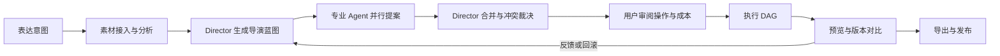

# VisionCut AI 系统架构

> 本文是 VisionCut AI 的产品与工程执行基线。它同时描述当前仓库的真实能力和生产级目标架构，不把界面原型、确定性规则或外部工具交接描述为已经上线的 AI 基础设施。

## 1. 状态基线

### 1.1 当前浏览器 MVP 已实现

| 能力 | 当前实现 | 明确边界 |
| --- | --- | --- |
| 意图入口 | Home Studio 接收自然语言意图，创建项目并把意图带入编辑器 | 意图仅在浏览器会话内传递，不是服务端 Intent 记录 |
| AI 创作工作台 | Guided/Pro 两层体验、任务配方、推荐、专业参数和可审阅执行队列 | 推荐和队列由前端类型化规则生成，不是真实模型推理或分布式调度 |
| 导演蓝图 | 可生成结构化创作方向、步骤、交付版本和 ChatCut 交接数据 | 当前主要是确定性规划器；ChatCut 是显式交接，不是内嵌 Agent 服务 |
| Story Graph | 可查看、选择、拖动和缩放故事节点 | 当前是创作规划界面，不是持久化的语义图数据库，也没有自动素材证据绑定 |
| 局部执行 | 部分计划可以作用于现有编辑器，并阻止同一计划重复应用 | 不是完整执行 DAG；尚无服务端事务、审批流和跨设备恢复 |
| 媒体处理 | 浏览器导入、预览、时间线编辑、本地存储和现有导出能力 | 大文件、后台上传、云端代理文件和服务端渲染尚未实现 |
| 开放素材 | Openverse 搜索、安全缩略图代理、许可与来源信息传递 | 仅是素材连接器；用户仍需遵守具体许可和署名要求 |
| 数据基础 | 项目媒体主要使用 IndexedDB/OPFS；仓库已有 PostgreSQL/Drizzle 的认证、会话和反馈表 | 尚无 Project、Asset、Scene、Version、AgentRun 或 CreatorDNA 的生产表 |
| 响应式体验 | 手机和平板可进入 AI、素材、预览和时间线视图 | 复杂多轨精修仍以桌面端为主，移动端尚无断点续传和后台任务通知 |

### 1.2 生产级目标架构尚未实现

以下能力均不得在产品、文档或演示中表述为“已上线”：

- 真实 ASR、说话人分离、镜头切分、人物/物体识别、情绪理解和留存预测。
- 可持久化的 Director、Story、Editor、Visual/Camera、Color、Sound、Growth 多 Agent 编排。
- 项目记忆、跨项目 Creator DNA 学习、向量检索及可解释偏好更新。
- 云端对象存储、分片上传、代理媒体、异步视频分析、服务端渲染和发布连接器。
- VisionCut 项目域的 PostgreSQL 数据模型、不可变版本账本、协作权限和审计日志。
- 独立 API、worker、队列、失败重试、死信队列、成本预算和生产可观测性。

## 2. 产品不变量

这些规则高于具体页面和技术选型：

1. **意图优先**：默认入口是“我想做什么”，不是空白时间线或按钮墙。
2. **人类导演，AI 执行**：AI 负责理解、规划和执行候选方案，用户保留最终决定权。
3. **先提案后改动**：除用户明确授权的自动模式外，Agent 只能提交可审阅操作，不可直接改写项目。
4. **证据可追溯**：每个剪辑建议必须能指向素材、转录片段、镜头或用户偏好，不能伪造分析结果。
5. **可逆与可比较**：每次执行形成新版本，支持撤销、版本对比和回滚；禁止覆盖唯一原始版本。
6. **渐进式深度**：小白看到目标、结果和一个主操作；专业用户可展开阈值、镜头规则、音频与交付参数。
7. **Timeline 是精修工具**：Story Graph 和导演蓝图承担主要结构决策，时间线保留为可选的专业控制层。
8. **隐私默认收敛**：素材不因使用产品而自动进入训练集；Creator DNA 必须可查看、关闭、导出和删除。
9. **诚实降级**：模型、网络或 worker 不可用时显示真实状态并保留人工路径，不用模拟成功填补空缺。

## 3. 核心创作流程



| 阶段 | 必须产物 | 当前 MVP | 生产完成条件 |
| --- | --- | --- | --- |
| 意图 | `IntentSpec`：受众、平台、目标、时长、风格、约束 | 前端意图和创意简报 | 服务端持久化、版本化、可追踪来源 |
| 理解 | `MediaIndex`：时间码、转录、镜头、人物、质量、证据 | 浏览器媒体元数据 | 分析 worker 产出带模型版本和置信度的索引 |
| 蓝图 | `DirectorBlueprint`：叙事、节奏、视听策略、交付版本 | 确定性结构化计划 | Director 基于意图、素材证据和预算生成并通过 schema 校验 |
| Agent 提案 | 各领域 `AgentProposal` | UI 展示角色和规则队列 | Agent 独立运行、并行化、可重试且不能直接写项目 |
| 审阅 | 操作差异、理由、证据、预计时长和成本 | 可查看计划与局部执行状态 | 支持逐项接受、拒绝、修改和批量审批 |
| 执行 | 有依赖关系的 `EditOperation[]` | 少量浏览器本地操作和 ChatCut 交接 | 幂等执行 DAG、检查点、补偿操作和完整日志 |
| 版本 | `ProjectVersion`、预览代理和比较结果 | 编辑器本地撤销/项目状态 | 不可变版本、分支、比较、回滚和跨设备恢复 |
| 导出 | `RenderJob`、QC 报告、交付文件 | 现有浏览器导出路径 | 服务端渲染、质量检查、多比例批量输出和发布记录 |

## 4. 模块边界

| 模块 | 单一职责 | 不允许承担 |
| --- | --- | --- |
| `web` | 意图采集、Story Graph、审阅、预览、轻量本地编辑 | 长时模型任务、可信持久化、服务端渲染 |
| `api` | 鉴权、项目命令、查询、签名上传、审批和任务状态 | 在请求线程中处理视频或直接运行长时 Agent |
| `ai-core` | Agent 契约、提示版本、工具权限、合并策略、模型适配 | 直接访问 UI 状态或绕过审批修改项目 |
| `orchestrator` | 把蓝图拆为 DAG，调度 Agent，处理依赖、预算与取消 | 执行 FFmpeg 或保存二进制素材 |
| `video-intelligence` | 媒体探测、ASR、镜头与语义索引 | 决定最终叙事或修改项目 |
| `video-engine` | 标准化编辑操作、时间码、代理、渲染图和 QC | 自行生成创作意图 |
| `worker` | 消费幂等任务，写入产物和进度事件 | 接受未经鉴权的用户请求 |
| `database` | 元数据、版本、操作、记忆、审计和任务状态 | 存放大体积原始视频 |
| `object-storage` | 原片、代理、分析产物、预览和导出文件 | 保存权限决策或业务状态真相 |
| `event-bus` | 任务进度、领域事件和失效通知 | 作为永久业务数据源 |
| `observability` | 日志、指标、追踪、成本和质量评估 | 记录不必要的原始素材或完整敏感提示词 |

目标工程可沿用 Part 8 的 monorepo 方向：`apps/web`、`apps/api`、`apps/worker` 与 `packages/ui`、`packages/ai-core`、`packages/video-engine`、`packages/database`。在拆分之前，先以模块接口隔离职责，不为目录形式提前制造分布式复杂度。

## 5. Agent 契约

### 5.1 共同规则

- Director 是唯一编排者；专业 Agent 只提交提案，不能直接写入项目版本。
- 所有输入引用固定的 `projectVersionId` 和 `mediaIndexVersion`，避免基于变化中的项目执行。
- 所有输出必须通过版本化 JSON Schema；自由文本只能作为解释，不能作为执行指令。
- 每条操作包含 `operationId`、前置条件、证据、置信度、预计成本和可逆策略。
- 同一 `idempotencyKey` 重试不得产生重复操作或重复扣费。
- Agent 必须声明使用的模型、提示版本、工具、耗时、token/算力成本和失败原因。
- 低置信度、无素材证据、版权不明或高风险操作自动进入人工审阅。

```json
{
  "runId": "uuid",
  "agent": "editor",
  "contractVersion": "visioncut.agent/v1",
  "input": {
    "projectVersionId": "uuid",
    "intentId": "uuid",
    "mediaIndexVersion": 3,
    "constraints": {},
    "budget": { "maxSeconds": 120, "maxCostUsd": 0.5 }
  },
  "proposal": {
    "summary": "压缩停顿并保留自然呼吸",
    "operations": [],
    "evidenceRefs": ["transcript:asset-1:12.4-15.8"],
    "confidence": 0.88,
    "requiresReview": true
  }
}
```

### 5.2 角色边界

| Agent | 输入重点 | 输出 | 禁止 |
| --- | --- | --- | --- |
| Director | 意图、素材覆盖、项目记忆、预算 | 蓝图、任务 DAG、冲突裁决、验收目标 | 直接生成不可审阅的最终修改 |
| Story | 转录、场景、角色、情绪证据 | 叙事弧、段落、开场、高潮、结尾建议 | 推断素材中不存在的事实 |
| Editor | 镜头、节奏、平台和时长 | 选段、排序、裁切、转场和 B-roll 操作 | 擅自改写品牌或事实信息 |
| Visual/Camera | 构图、清晰度、主体、素材缺口 | 重构图、景别、补拍/生成建议 | 把生成画面伪装成真实记录 |
| Color | 色彩空间、曝光、风格目标 | 可参数化调色操作和镜头匹配 | 破坏肤色、广播范围或源色彩管理 |
| Sound | 语音、音乐、噪声、响度目标 | 清理、混音、音效、ducking 和响度操作 | 使用许可不明音乐 |
| Growth | 平台、受众、发布目标 | Hook 变体、封面、标题、比例和版本建议 | 以误导性承诺替代内容质量 |

Director 合并提案时按“事实与安全 > 用户硬约束 > 故事连贯 > 技术质量 > 风格偏好 > 增长优化”裁决。冲突无法自动解决时必须展示差异让用户选择。

## 6. 项目记忆与 Creator DNA

### 6.1 三层记忆

1. **会话记忆**：本次对话、临时选择和未提交提案，项目关闭后可过期。
2. **项目记忆**：意图版本、接受/拒绝记录、素材证据、蓝图、版本和导出结果，只服务当前项目。
3. **Creator DNA**：跨项目的稳定偏好，例如平均镜头长度、字幕密度、色彩倾向、音乐类型和常用平台。

### 6.2 更新协议

- 只从明确选择和实际编辑差异学习，不把一次性提示直接当永久偏好。
- 每个偏好保存 `value`、`confidence`、`sampleCount`、`lastObservedAt` 和证据事件。
- 用户拒绝一次降低置信度，多次一致选择才提升为默认值；长期未观察的偏好自动衰减。
- 第一阶段 Creator DNA 是可解释的结构化特征，不训练个人模型权重。
- UI 必须允许查看“为什么这样推荐”、临时忽略、编辑、暂停学习、导出和彻底删除。
- 原片、转录和人脸特征默认不用于全局模型训练；任何二次用途必须单独、可撤销地授权。

## 7. 视频处理管线

生产目标管线按不可变产物推进：

1. **接入**：分片上传、断点续传、SHA-256 去重、大小和配额校验。
2. **验证**：文件魔数、容器/编码探测、恶意文件扫描、时长与轨道检查。
3. **标准化**：保留原片，生成低码率代理、波形、关键帧和缩略图。
4. **音频理解**：VAD、ASR、词级时间码、语言识别和可选说话人分离。
5. **视觉理解**：镜头边界、模糊/抖动/曝光质量、主体与可选人物跟踪。
6. **语义索引**：把转录、镜头、实体、情绪推断和质量指标统一为可版本化 `MediaIndex`。
7. **粗剪规划**：Director 与专业 Agent 只引用索引证据生成候选操作，不复制媒体本体。
8. **代理预览**：在低成本代理上执行，生成可逐项审阅的差异和预览。
9. **正式渲染**：锁定版本和依赖，使用原片执行确定性渲染图。
10. **QC 与交付**：检查黑帧、静音、响度、字幕安全区、分辨率、帧率和许可，再生成导出清单。

每个分析产物记录算法/模型版本、输入哈希、参数、置信度和生成时间。情绪、留存等主观预测必须标为“推断”，不可包装成事实。

## 8. PostgreSQL 建议实体

对象存储保存二进制文件，PostgreSQL 保存关系、状态和引用。所有项目域表包含 `workspace_id`，使用行级权限隔离。

| 实体 | 关键字段 | 说明 |
| --- | --- | --- |
| `users`, `workspaces`, `workspace_members` | identity、role、status | 复用并扩展当前认证基础 |
| `projects` | owner、title、status、active_version_id | 项目根记录 |
| `intents` | project_id、version、prompt、spec_jsonb | 可版本化用户意图 |
| `assets` | object_key、hash、media_type、duration、status | 原片与许可元数据 |
| `asset_derivatives` | asset_id、kind、object_key、spec_jsonb | 代理、波形、关键帧、转录 |
| `scenes` | asset_id、start_ms、end_ms、evidence_jsonb | 可追溯镜头/场景索引 |
| `story_graphs`, `story_nodes`, `story_edges` | version、kind、order、payload | 语义故事结构，不等同时间线 |
| `director_blueprints` | intent_id、schema_version、payload、status | 审阅前的导演方案 |
| `ai_sessions` | project_id、model_policy、started_at | 一次可追踪的 AI 会话 |
| `agent_runs` | agent、input_ref、model、prompt_version、status、cost | Agent 执行记录 |
| `agent_proposals` | run_id、operations_jsonb、evidence_jsonb、confidence | 不直接修改项目的提案 |
| `project_versions` | parent_id、snapshot_ref、created_by、reason | 不可变版本和分支关系 |
| `edit_operations` | version_id、type、payload、inverse_payload、order | 可验证、可逆的标准操作 |
| `creator_profiles`, `creator_preferences` | key、value_jsonb、confidence、sample_count | 可解释 Creator DNA |
| `preference_events` | preference_id、source_version_id、decision | 偏好学习证据 |
| `jobs`, `job_attempts` | type、state、progress、idempotency_key、error | 异步任务真相 |
| `render_jobs`, `exports` | version_id、preset、artifact_ref、qc_jsonb | 渲染与交付记录 |
| `audit_events` | actor、action、resource、metadata | 安全与协作审计 |

向量检索可使用 `pgvector`，但向量只是检索索引；原始事实、权限和版本关系仍以关系表为准。版本快照可放对象存储，数据库保留哈希和引用。

## 9. API、worker 与队列边界

### 9.1 同步 API

- `POST /v1/projects`：创建项目。
- `POST /v1/projects/{id}/intents`：提交新意图版本。
- `POST /v1/uploads`：获取分片上传会话与签名 URL。
- `POST /v1/projects/{id}/blueprints`：创建导演规划任务，立即返回 `jobId`。
- `POST /v1/proposals/{id}/decisions`：接受、拒绝或修改提案。
- `POST /v1/projects/{id}/versions`：从已批准操作创建新版本。
- `POST /v1/renders`：提交渲染任务。
- `GET /v1/jobs/{id}` 与 SSE/WebSocket：读取状态和增量进度。

所有写接口要求鉴权、工作区权限、请求 schema、`Idempotency-Key` 和审计记录。API 只创建命令和短事务，不在请求生命周期内分析或渲染视频。

### 9.2 队列与 worker

建议独立队列：`media.probe`、`media.proxy`、`media.transcribe`、`media.vision`、`ai.plan`、`ai.agent`、`edit.preview`、`render.final`、`delivery.publish`。

- 消息只传 ID 和不可变版本，不传大二进制。
- 数据库 `jobs` 是状态真相；队列负责投递，不能成为唯一状态来源。
- worker 先领取租约，再检查幂等键；结果先持久化，随后发布完成事件。
- 瞬时失败指数退避；确定性失败直接终止；超过次数进入死信队列并给出可操作原因。
- 支持取消、超时、心跳、优先级、并发限制和每工作区成本预算。
- Agent 可按依赖并行，Director 合并必须等待所需提案或显式处理超时降级。

## 10. 安全与隐私

- **身份与租户**：所有项目查询同时校验用户、工作区和资源关系；生产表启用并测试 RLS。
- **素材访问**：对象存储默认私有，使用短时签名 URL；日志不得记录签名 URL、原片或完整转录。
- **上传安全**：限制大小、格式和解码资源，校验魔数，隔离扫描，防止压缩炸弹与恶意媒体。
- **外部访问**：连接器使用固定域名、禁止任意重定向、限制 MIME/字节/超时，沿用当前 Openverse 代理的 SSRF 防线。
- **Agent 安全**：转录、文件名和网页内容均视为不可信数据；工具白名单、结构化参数和权限令牌防止提示注入越权。
- **模型隐私**：按供应商记录数据保留政策；敏感项目可选择零保留供应商或私有模型。
- **人脸与声音**：明确用途、最小化存储、单独授权；未授权不得建立跨项目生物特征身份。
- **版权**：保存来源、许可、署名和生成标记；导出前运行许可检查并允许用户修正。
- **删除与导出**：删除请求覆盖数据库、对象、索引、缓存和派生产物，并保留可证明但不含内容的审计结果。
- **运营安全**：密钥托管、传输/静态加密、依赖扫描、速率限制、异常成本告警和灾备恢复演练。

## 11. 移动端与平板策略

移动端不是压缩后的桌面时间线，而是“意图、素材、审阅、反馈、预览、导出”的第一类工作流。

- 手机默认五步：输入意图、选择/上传素材、确认蓝图、审阅变更、预览导出。
- Story Graph 使用横向可滚动节点或分段列表；专业参数放在底部抽屉，保持单一主操作。
- 平板采用 AI/Canvas 主区加可折叠检查器；只有用户主动进入精修时展示时间线。
- 所有触控目标至少 44px，避免 hover-only 操作；键盘、鼠标和触控状态一致。
- 上传必须支持分片、断点续传、蜂窝网络提示和应用回前台恢复。
- 只传输代理媒体用于审阅；按网络与设备性能选择分辨率，原片留在对象存储。
- 长任务由服务端继续执行，通过可恢复任务页和系统通知反馈，不依赖页面常驻。
- 320px 手机、常见平板横竖屏、弱网和低内存设备都是发布前固定验收矩阵。

## 12. 90 天阶段路线

### 第 1-15 天：契约与数据底座

- 冻结 `IntentSpec`、`MediaIndex`、`DirectorBlueprint`、`AgentProposal`、`EditOperation` schema。
- 建立项目域 PostgreSQL 迁移、RLS、对象存储和版本账本。
- 将浏览器 MVP 的确定性计划包装为同一契约的本地适配器，保持现有流程可用。
- 完成任务状态、幂等、审计和基础指标。

**出口条件**：项目、素材、意图和版本可跨设备恢复；旧浏览器项目有明确导入或保留策略。

### 第 16-30 天：媒体接入与代理

- 上线分片上传、校验、探测、代理、波形、关键帧和任务进度。
- 建立 `MediaIndex v1`，先实现 ASR 与镜头边界，保留模型/算法版本。
- 打通手机和平板的可恢复上传和代理预览。

**出口条件**：失败可重试或取消；原片不经 Web API 内存中转；一小时素材可稳定异步处理。

### 第 31-50 天：Director 与可审阅蓝图

- Director 使用真实素材证据生成 Hook、叙事、节奏、字幕、声音、色彩和交付策略。
- Story Graph 持久化并绑定转录/镜头证据。
- 建立 schema 校验、模型回退、成本预算和离线评测集。

**出口条件**：每条建议可定位证据；模型不可用时诚实降级到手动或确定性规划器。

### 第 51-70 天：多 Agent 与版本执行

- 上线 Story、Editor、Color、Sound Agent；Visual/Camera 与 Growth 可作为 P1。
- Director 并行调度、合并冲突；用户可逐项审阅、修改与批准。
- 执行标准操作 DAG，生成不可变版本、差异预览和回滚点。

**出口条件**：Agent 无权直接写项目；重试不重复执行；任一版本可比较和回滚。

### 第 71-90 天：渲染、Creator DNA 与 Beta

- 上线服务端预览/正式渲染、QC、多比例导出和交付清单。
- Creator DNA 只从明确决策更新，提供查看、暂停、编辑、导出和删除。
- 完成移动端全链路、配额/速率限制、隐私删除、渗透测试和生产观测。

**出口条件**：小白可在 10 分钟内完成首个可导出版本；专业用户能查看证据、参数、版本与成本。

100 图或更大规模的预生成素材库只作为素材储备项，不进入 90 天关键路径和发布验收。视觉质量优先于数量；核心流程稳定后再按真实使用数据扩充。

## 13. 验收标准

### 产品

- 新用户 5 秒内能识别主入口是“告诉 AI 想做什么”。
- 有素材的标准项目在 10 分钟内得到首个可预览、可审阅、可导出的版本。
- Guided 模式无需理解剪辑术语；Pro 模式可控制阈值、镜头、声音、颜色和交付参数。
- Story Graph 负责叙事结构，Timeline 不得重新成为默认起点。

### AI 与执行

- 100% Agent 输出通过版本化 schema 校验；100% 执行操作有来源、状态和审计记录。
- 任何建议都能说明使用了哪些意图、素材证据和 Creator DNA 偏好。
- 未批准提案不改变正式项目；失败执行不产生半成品正式版本。
- 相同版本与参数的重试结果幂等；版本比较、撤销和回滚通过端到端测试。
- 主观预测显示置信度和“推断”标签，不展示虚构评分或伪完成状态。

### 视频与交付

- 上传、分析、代理、预览、正式渲染和 QC 各自可重试、取消并恢复。
- 输出符合目标比例、分辨率、帧率、响度、字幕安全区和许可要求。
- 渲染锁定项目版本、素材哈希、引擎版本与预设，结果可复现。

### 安全、性能与设备

- 跨租户访问、任意 URL 抓取、恶意媒体和提示注入均有自动化负向测试。
- 删除与 Creator DNA 关闭流程通过数据清单验证，不仅隐藏 UI。
- 桌面、平板和 320px 手机完成同一 AI 主流程；触控无重叠、无 hover 依赖。
- API 和 worker 有延迟、失败率、队列深度、模型质量与单项目成本告警。

## 14. 发布表述规则

在生产目标完成前，产品统一使用以下表述：

- 当前规划器称为“浏览器导演蓝图”或“规则辅助规划”，不称为已训练 AI 导演。
- 当前角色队列称为“Agent 工作流预览”，不称为多个 Agent 已在云端完成分析。
- 当前 Story Graph 称为“可编辑故事草案”，不称为自动理解出的事实结构。
- 当前 Creator DNA 称为“规划中的个性化能力”或“等待用户反馈”，不声称已经跨项目学习。
- 只有拿到真实 worker 产物、模型版本、证据和持久化记录后，步骤才可显示“AI 已分析/已完成”。

